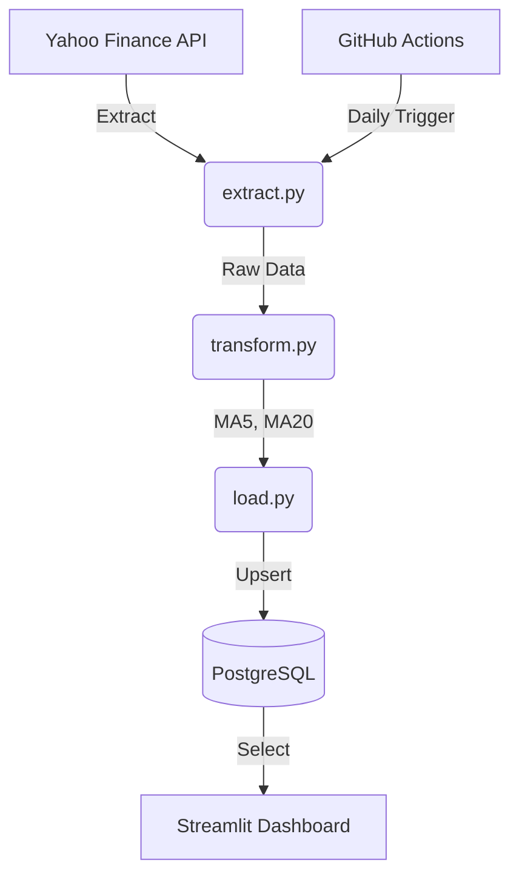

# Market Pulse ETL & Dashboard

A professional-grade financial data pipeline that extracts stock data, transforms it with technical indicators (MA), and loads it into a PostgreSQL data warehouse. Includes a Streamlit dashboard for visualization.

## 🏗️ Architecture



## 🛠️ Tech Stack

- **Language:** Python 3.10+
- **Data Processing:** Pandas
- **Database:** PostgreSQL (SQLAlchemy + psycopg2)
- **Visualization:** Streamlit + Plotly
- **Automation:** GitHub Actions
- **Environment:** python-dotenv

## 📊 Database Schema

### `fact_price` (Fact Table)
| Column | Type | Description |
|--------|------|-------------|
| stock_id | VARCHAR(20) | Stock ticker (PK) |
| date | DATE | Trading date (PK) |
| open_price | NUMERIC | Opening price |
| high_price | NUMERIC | Day high |
| low_price | NUMERIC | Day low |
| close_price | NUMERIC | Closing price |
| volume | BIGINT | Trading volume |
| ma5 | NUMERIC | 5-day Moving Average |
| ma20 | NUMERIC | 20-day Moving Average |

## 🚀 Setup Guide

### 1. Local Development
1. Clone the repository.
2. Install dependencies:
   ```bash
   pip install -r requirements.txt
   ```
3. Copy `.env.example` to `.env` and fill in your database credentials:
   ```bash
   cp .env.example .env
   ```
4. Initialize the database (run `schema.sql` in your Postgres instance).
5. Run the ETL manually:
   ```bash
   python main.py
   ```
6. Launch the dashboard:
   ```bash
   streamlit run app.py
   ```

### 2. GitHub Actions Deployment
1. Go to your GitHub Repo **Settings > Secrets and variables > Actions**.
2. Add the following secrets: `DB_HOST`, `DB_PORT`, `DB_NAME`, `DB_USER`, `DB_PASSWORD`.
3. The workflow will run automatically every weekday at 22:00 UTC.

## 🛡️ Best Practices
- **Type Hinting**: All functions include type annotations.
- **Logging**: Comprehensive logging substituted for print statements.
- **Security**: Hard-coded credentials are strictly prohibited; managed via `.env` and GitHub Secrets.
